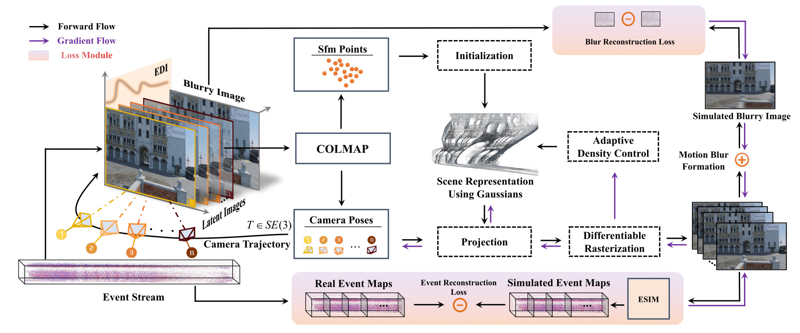
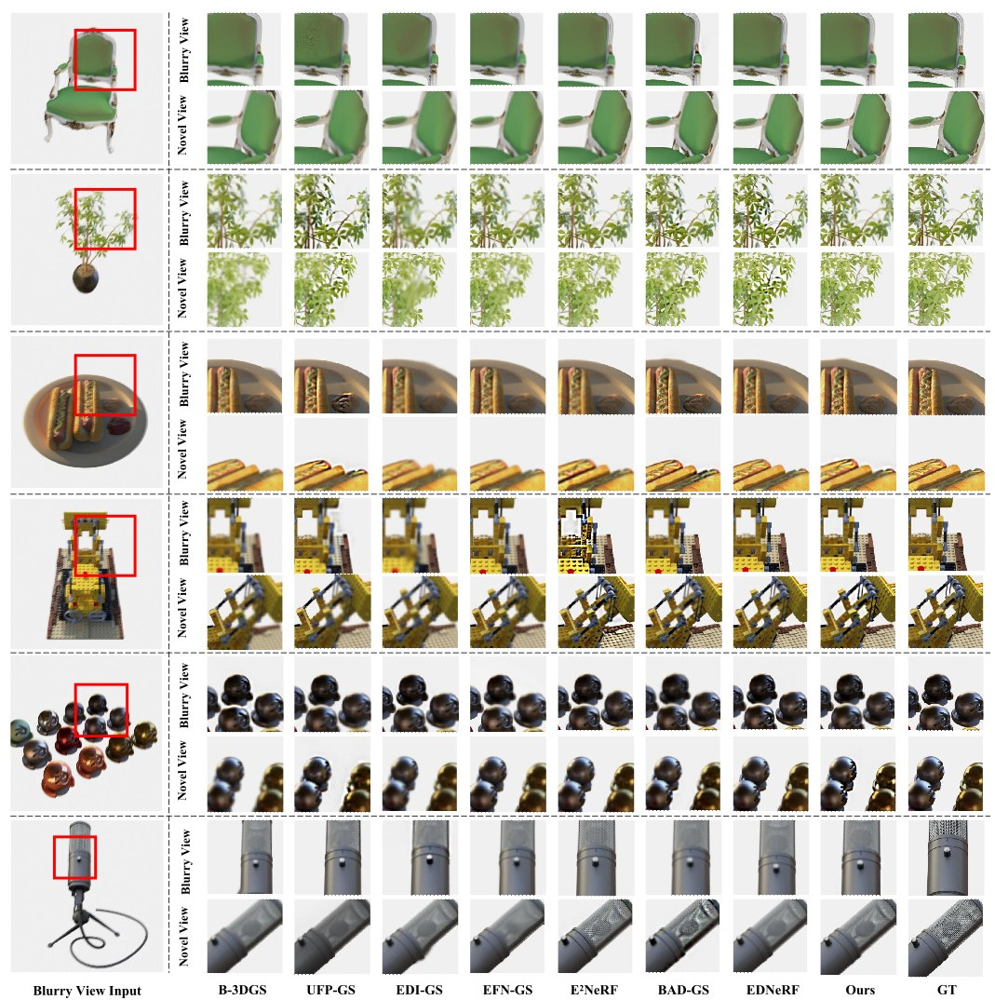
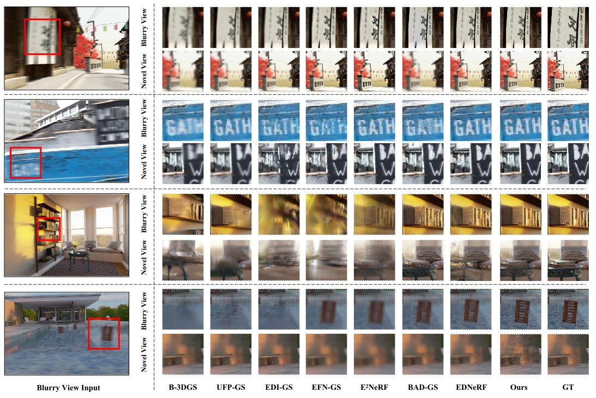
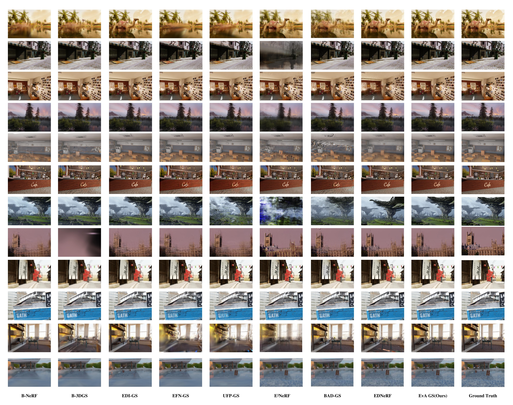
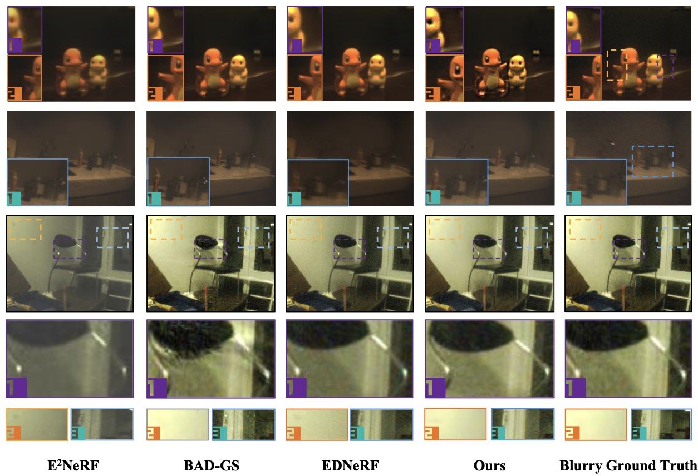
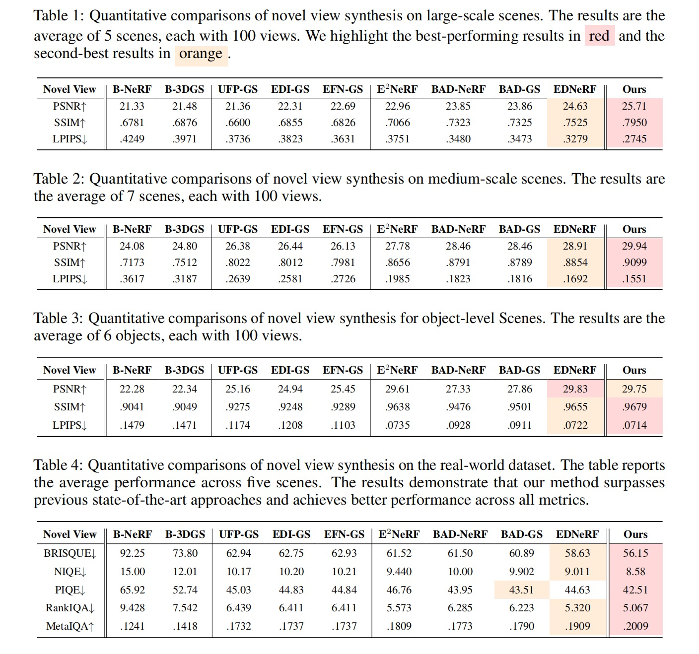
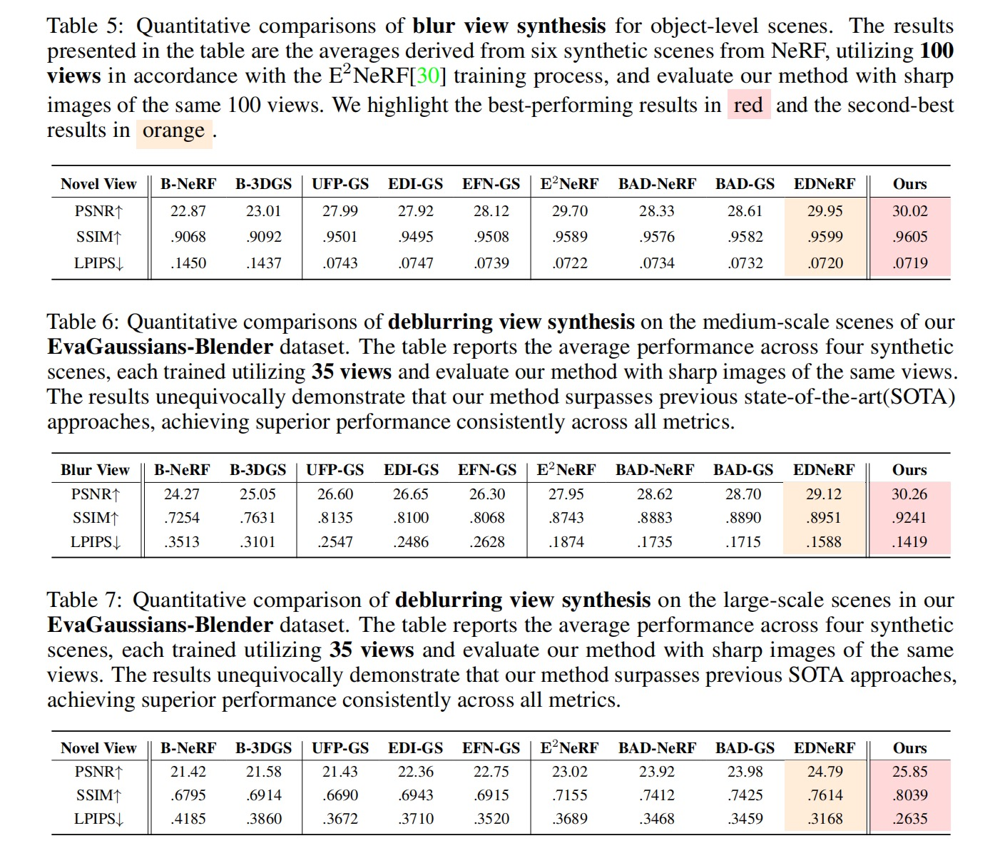

<h2 align="center"> 
  <a href="https://github.com/SuperFCR/EvaGaussians.git">EvaGaussians:Event Assisted Gaussian Splatting from Blurry Images</a>
</h2>
<h5 align="center"> 
If you like our project, please give us a star ⭐ on GitHub for latest update.  </h5>
<h5 align="center">


[](https://github.com/SuperFCR/EvaGaussians/blob/main/LICENSE) 
[](https://github.com/SuperFCR/EvaGaussians/stargazers)&#160;
[](https://github.com/SuperFCR/EvaGaussians/network)&#160;
[](https://github.com/SuperFCR/EvaGaussians/watchers)&#160;
[](https://github.com/SuperFCR/EvaGaussians/archive/refs/heads/main.zip)

</h5>

Implemetation of EvaGaussians: Event Stream Assisted Gaussian Splatting from Blurry Image


## 🗓️ TODO
We will update the following list after the paper is accepted.
- [x] [2024-05-29] We have released our [project page](https://drexubery.github.io/EvaGaussians/).
- [x] [2024-05-29] We have uploaded our paper, EvaGaussians on [arxiv]()
- [ ] Upload raw dataset
- [ ] Upload the blender file and scripts
- [ ] Upload the code

## 🍭 Novel and Deblurring View Synthesis Results
### 🌅 Qualitative comparison






### 📊 Quantitative comparison



<!-- <h2>
  
  Acknowledgements
</h2> -->
## 🙏 Acknowledgements

This source code is derived from multiple sources, in particular: 
[gaussian-splatting](https://github.com/graphdeco-inria/gaussian-splatting/tree/main), 
[rpg_vid2e](https://github.com/uzh-rpg/EvDeblurNeRF). We thank the authors for releasing their code.

```bibtex
@Article{kerbl3Dgaussians,
      author       = {Kerbl, Bernhard and Kopanas, Georgios and Leimk{\"u}hler, Thomas and Drettakis, George},
      title        = {3D Gaussian Splatting for Real-Time Radiance Field Rendering},
      journal      = {ACM Transactions on Graphics},
      number       = {4},
      volume       = {42},
      month        = {July},
      year         = {2023},
      url          = {https://repo-sam.inria.fr/fungraph/3d-gaussian-splatting/}
}

@InProceedings{Gehrig_2020_CVPR,
  author = {Daniel Gehrig and Mathias Gehrig and Javier Hidalgo-Carri\'o and Davide Scaramuzza},
  title = {Video to Events: Recycling Video Datasets for Event Cameras},
  booktitle = {{IEEE} Conf. Comput. Vis. Pattern Recog. (CVPR)},
  month = {June},
  year = {2020}
}
```


## 🤝 Contributors

<a href="https://github.com/SuperFCR/EvaGaussians/graphs/contributors">
  
</a>